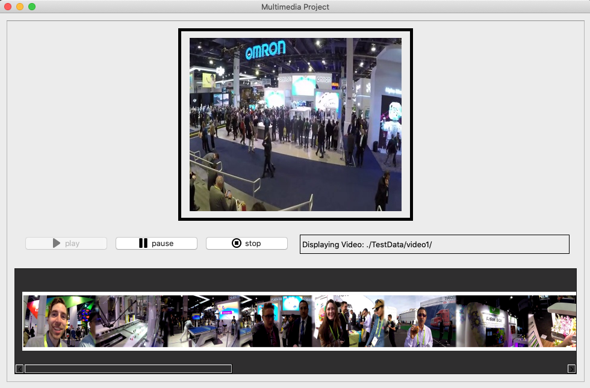

# synopsis_images_of_video

## Project description
Given an input video file (a sequence of rgb) and an audio WAV file
Output: A synopsis image (or a hierarchy of images) for the media elements. This image will a visual representation of all the “important” parts of the media elements.

## Demo [Youtube-link](https://www.youtube.com/watch?v=Dq_MfTj7Q2g&feature=youtu.be) 

## Key frame extraction
### Video:
1. Scene segmentation (Structural Similarity, Color Histogram, Motion)
2. Find candidates frames from each scene
3. Pick key frames by our ranking system
4. Postprocessing (deduplication)

### Images:
1. Candidates selection ½ faces and ½ others
2. Select top k based on brightness, contrast, blur detection and K-Means clustering

### UI Interface using Qt-designer

